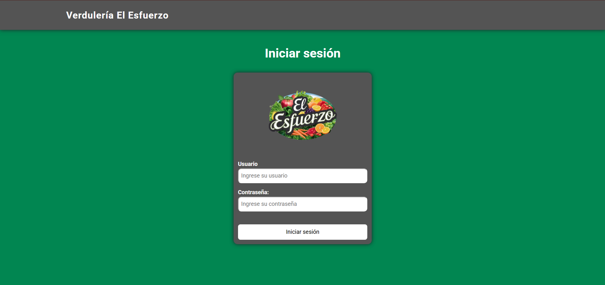
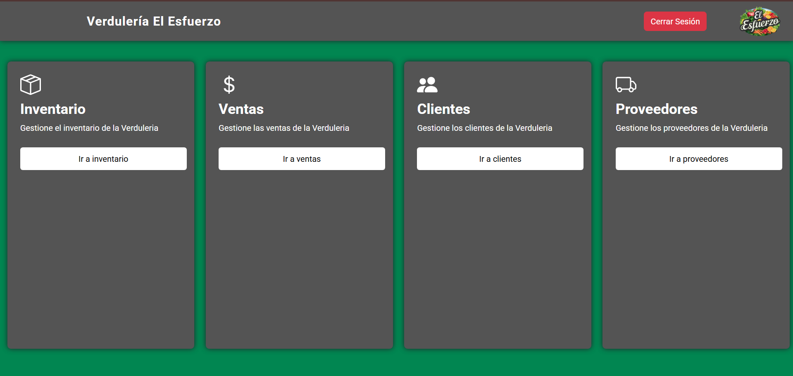
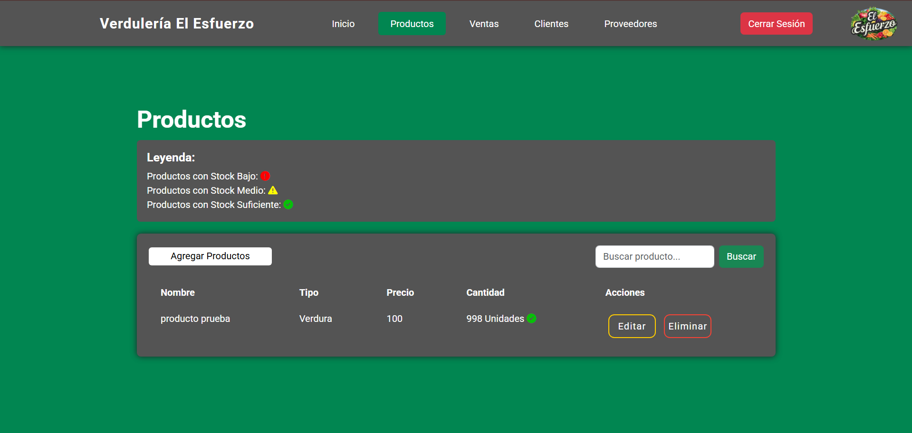
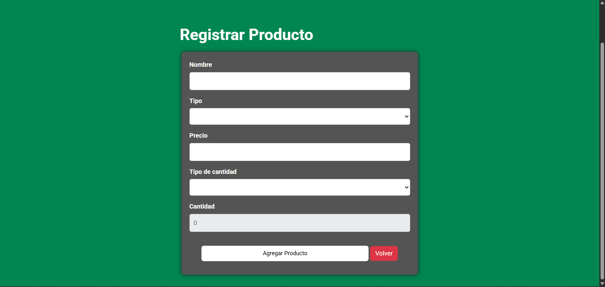
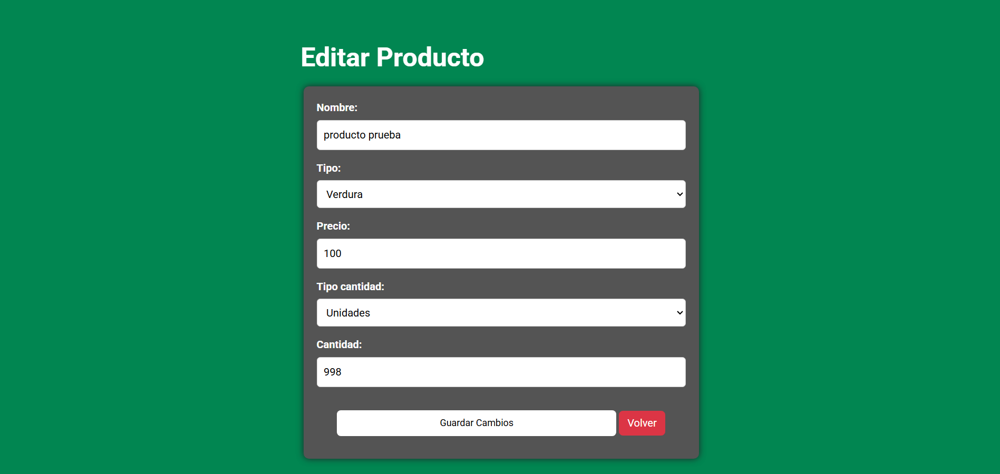
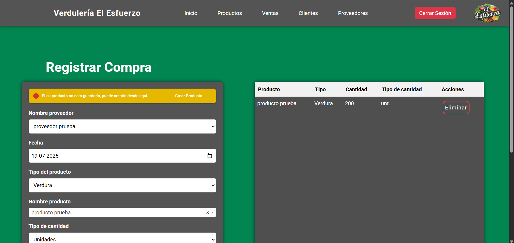
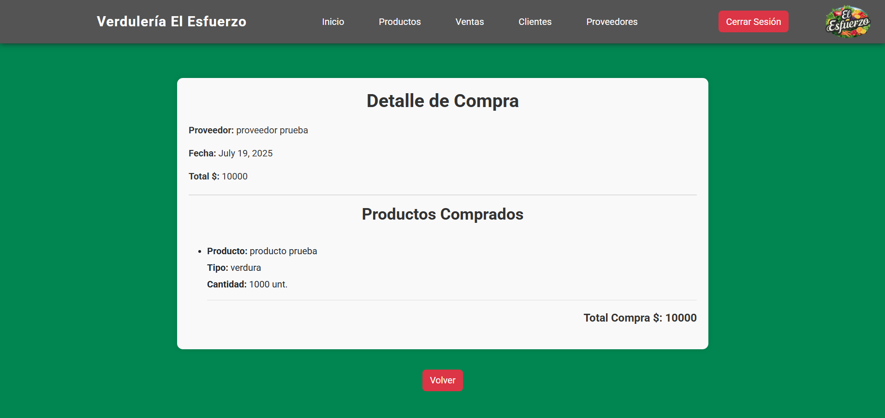

# 📦 Sistema de gestíon de inventario - El Esfuerzo
Este sistema web fue desarrollado como parte del proyecto final de la asignatura Portafolio de Título, correspondiente a la carrera de Analista Programador.

El sistema permite la gestíon de inventario de en este caso "Verduleria El Esfuerzo" desde un panel de Administrador donde se incluye, Inventario (Productos), Ventas, Clientes, Proveedores/Compras.

---
# ✨ Fucionalidades principales

El sistema incluye un conjunto de funcionalidades esenciales para la gestión integral de inventario en una verdulería, abarcando desde productos hasta ventas y clientes:

1.  **Gestión de Productos**
    - CRUD completo de productos (crear, editar, eliminar, listar).
    - Buscador por nombre de producto.
    - Visualización del stock disponible, mediante iconos que indican si es necesario realizar un abastecimiento del producto.
        
2.  **Gestión de Compras**
    - Registro de compras con múltiples productos por operación.
    - Asociar productos comprados con cantidades y tipo de medida.
    - Visualización tipo boleta/detalle de cada compra.
        
3.  **Gestión de Proveedores**
    - CRUD de proveedores, permitiendo su asignación en las compras.
    - Control centralizado de los proveedores registrados.
        
4.  **Gestión de Ventas**
    - Registro de ventas manuales con selección de productos.
    - Registro de ventas con múltiples productos por venta.
    - Registro automático de la fecha de venta.
    - Actualización automática del stock al realizar una venta.
        
5.  **Gestión de Clientes**
    - Registro automático de clientes al momento de realizar una venta.
    - Asociar ventas anteriores a cada cliente registrado.
        
6.  **Detalle de operaciones**
    - Vista tipo "boleta" para cada compra y venta. 
    - Acceso al historial detallado de cada operación realizada.
        
7.  **Control básico de stock**
    - Reducción automática del stock en cada venta.
    - Aumento del stock al registrar una compra.
        
8.  **Sistema autenticado**
    - Acceso protegido mediante login de usuario.
    - Restricción de vistas a usuarios no autenticados.
---

# 🛠️ Construido con

**Backend**
- Lenguaje utilizado [Python 3.9](https://www.python.org/)
- Framework utilizado [Django](https://www.djangoproject.com/) 

**Base de datos**
- Base de datos utilizada [SQLite](https://www.sqlite.org/)

**Frontend**
- HTML, CSS, JavaScript
- [Bootstrap](https://getbootstrap.com/)
- [SweetAlert2](https://sweetalert2.github.io/)
---

# ⚙️Instalación local
### 1. Clonar el repositorio

```bash
git clone https://github.com/Nordic2025/Sistema_ElEsfuerzo.git
cd Sistema_ElEsfuerzo
```

### 2. Crear y activar entorno virtual
```bash
python -m venv env # Puede ser python o py
env\Scripts\activate
```
### 3. Instalar las dependencias
```bash
pip install -r requerimientos.txt
```
### 4. Aplicar las migraciones correspondientes
```bash
python manage.py migrate
```
### 5. Crear un superusuario
Se utiliza para acceder al Panel de Administrador.
```bash
python manage.py createsuperuser
```
### 6. Ejecutar el servidor
```bash
python manage.py runserver
```

---
# 📸 Capturas del sistema

A continuación se muestran algunas capturas representativas del sistema. No se incluyen todos los formularios o vistas, ya que muchas comparten estructura y funcionalidad similar.

### 🟢 Inicio de sesión


### 🟢 Vista principal


### 🟢 CRUD de productos





### 🟢 Formulario y detalle de compra/venta
El formulario y detalle de ventas funciona en general de la misma manera que el que se muestra a continuación.



- Detalle o boleta


---

# ✒️ Autores

- **Claudio Pincheira Carter** – Desarrollo del módulo de ventas, clientes, panel principal, login.
- [**Luis Inostroza Valenzuela**](https://github.com/SrLuchohub) – Desarrollo del módulo proveedores, compras, productos.


# 📄 Licencia

Este proyecto fue desarrollado como parte de la asginatura **Portafolio de Título** de la carrera Analista Programador del instituto CFT San Agustín, Linares

**Este proyecto tiene fines académicos y no se recomienda su uso comercial sin mejoras técnicas previas.**

---
# ℹ️ Notas adicionales

- El sistema está optimizado para pantallas de escritorio (no responsivo para móviles).
